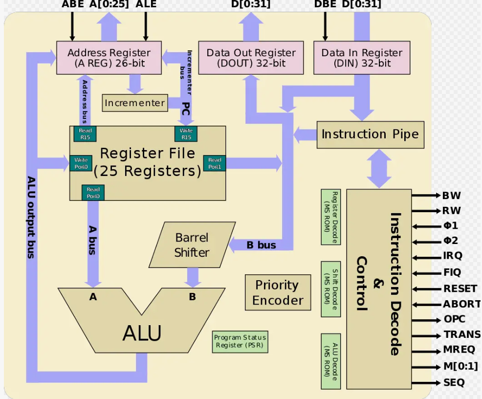
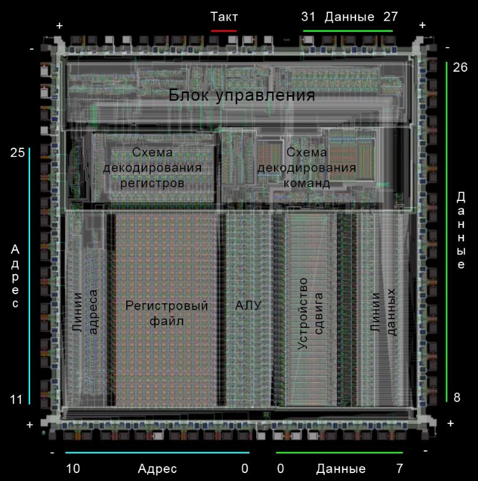
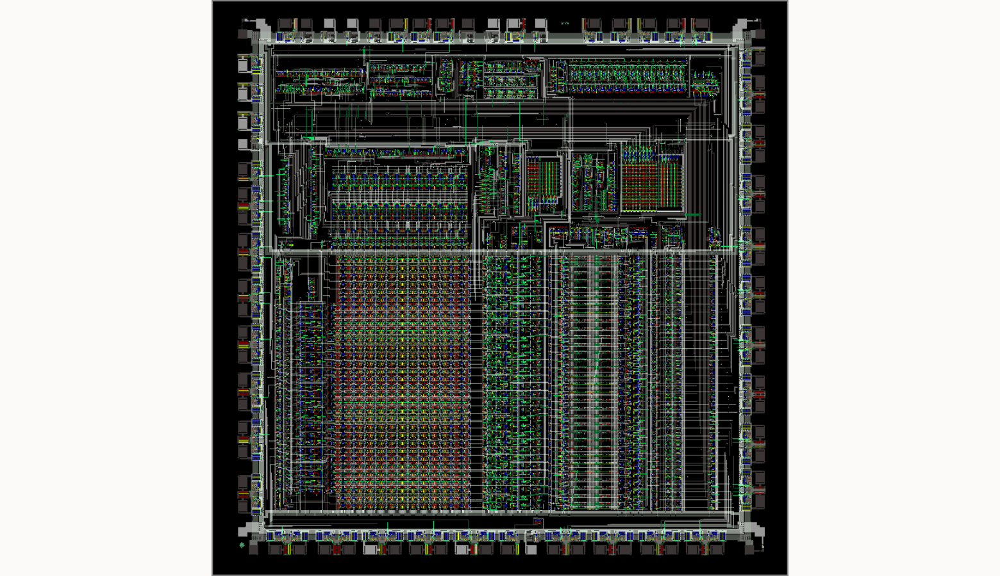
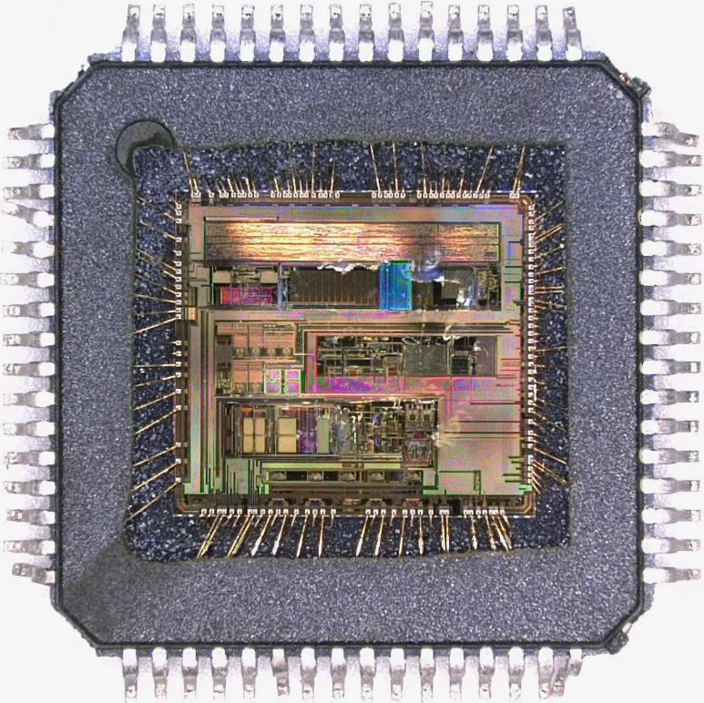
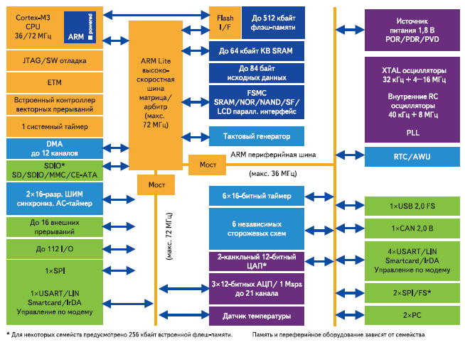
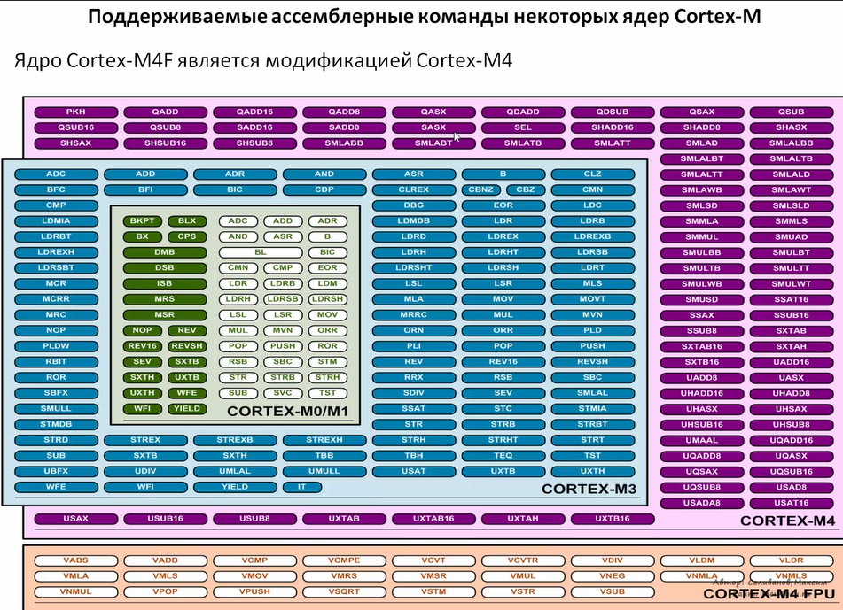

# Введение

Микроконтроллеры серии STM32 позволяют решать широкий спектр технических задач. В линейке STM представлены различные модели: от экономичных и компактных STM32L до мощных STM32H7, которые работают на частотах до 550 МГц.

Однако для эффективного использования этих устройств требуются определенные знания и навыки.

Существует несколько популярных библиотек для работы с микроконтроллерами серии STM: HAL (Hardware Access Level), LL (Low-Layer) и CMSIS (Cortex Microcontroller Software Interface Standard). У каждой из них свои преимущества и недостатки. HAL ускоряет разработку, но снижает производительность и увеличивает объём кода. LL занимает промежуточное положение между HAL и CMSIS, предлагая более низкий уровень абстракции. CMSIS даёт разработчику возможность напрямую работать с регистрами, создавая программу с нуля. Выбор библиотеки зависит от предпочтений программиста или команды. В этих лекциях мы сосредоточимся на CMSIS, так как она помогает глубже понять устройство и принципы работы микроконтроллера.

---

## Выбор микроконтроллера

Микроконтроллеры разных типов отличаются внутренним устройством, набором периферийных функций и названиями регистров. Однако эти различия не всегда существенны, особенно в рамках одной линейки. Например, переход между stm32f405, 407 и 411 не вызывает сложностей. При внимательном подходе программа легко переносится и между различными линейками.


В данном курсе я буду работать с платой black pill, на которой установлен микроконтроллер STM32F411CEU6.

---

## Документация

Первое, с чем нам придётся познакомиться - документация. Она как свод заповедей или уголовный кодекс - позволяет понять границы дозволенного и не наделать ошибок. Основными документами для работы с STM являются:

* [Datasheet](https://github.com/DekartVan/stm32f4xx/blob/main/Datasheet%20STM32F411.pdf)
* [Reference manual](https://github.com/DekartVan/stm32f4xx/blob/main/Reference%20manual%20STM32F411.pdf)
* [Programming Manual](https://github.com/DekartVan/stm32f4xx/blob/main/Programming%20manual%20STM32F411.pdf)
* [Errata Sheet](https://github.com/DekartVan/stm32f4xx/blob/main/Errata%20Sheet%20STM32F411.pdf)

### Datasheet

Datasheet содержит данные о периферийных устройствах микроконтроллера, его распиновке, электрических параметрах и маркировке.

Во-первых, обратим внимание на раздел _8. Ordering information_. Здесь объяснено значение каждого символа в маркировке. Например, для модели STM32F411CEU6 указаны 48/49 контактов, 512 килобайт Flash-памяти, корпус UFQFPN и рабочий температурный диапазон от -40 до +125 градусов Цельсия.

![!\[\[Pasted image 20260226223413.png\]\]](<../../Images/Ordering information.png>)

Далее рассмотрим раздел _2.1 Device overview_. В нем представлена таблица, показывающая, какая периферия имеется в микроконтроллере и в каком количестве.

![!\[\[Pasted image 20260226223637.png\]\]](<../../Images/features and peripheral counts.png>)

Эта информация важна для понимания возможностей камня. В даташите кратко описаны каждый блок периферии, его базовые функции и ограничения. На странице 38 в таблице «Table 8. STM32F411xC/xE pin definitions» указаны назначения каждого вывода и их функции. Мы вернемся к этой таблице позже.

Раздел «Electrical characteristics» описывает электрические параметры микроконтроллера: напряжения питания, токи потребления, условия и методы эксплуатации. Этот раздел особенно полезен при разработке электрических схем с использованием микроконтроллеров STM.

---

### Reference manual

Основной документ, необходимый нам для работы, — это Reference Manual. В нём детально описана архитектура микроконтроллера, вся периферия, регистры и их содержимое, а также советы и рекомендации для разработчиков. К этому документу мы будем обращаться чаще всего. Структура документа такова: сначала описывается определённая часть микроконтроллера (RCC, FLASH, GPIO, ADC и другие), а затем — регистры, относящиеся к этому блоку.


---

### Programming Manual

Этот документ пригодится нам не сразу, но в нём есть много полезной информации для разработчика: о ядре процессора, системе команд и периферийных устройствах. Он особенно полезен при детальном изучении микроконтроллера. Заметим, что в руководстве по программированию содержатся сведения обо всех микроконтроллерах на базе ядра Arm Cortex-M4, включая линейки STM32F3, F4, STM32G4, L4 и другие.

---

### Errata Sheet

Errata Sheet — это список всех известных багов и косяков в микроконтроллерах, а также советы, как о них не споткнуться. В отличии от Programming manual - errata sheet пишется для каждой версии контроллера отдельно. Есть баги, у которых нет решения :).


## Архитектура микроконтроллера

Ядро микроконтроллера - это лишь одна его состовная часть, помимо него имеется множество различной переферии. От памяти до интерфейсов. 

Чтобы разрбраться в устройстве МК - посмотрим на микросхему **74VHC00**, состаящую из 4 элементов И-НЕ:

|   |   |
|---|---|
| | | 


Данная микросхема выполняет операцию умножения с последующей инверсией. 

---

Теперь взглянем на более сложное устройство - АЛУ (арифметическо-логическое устрйоство) 74181 от TI, которое может выполнять примитивные опреации с числами от 0 до 15. Доступный перечень операций приведёт в таблице. Схема данного устройства изображается уже не отдельными компонентами, а целыми логическими элементами.

|   |   |
|---|---|
| |  |
| | |

---

Поднимемся ещё на шаг выше и посмотрим на отдельный микропроцессор ARM1 1985г, который может работать с 32-битными числами: 

|   |   |
|---|---|
||| 



На таком уровне уже нецелесообразно рисовать схему в виде отдельных логических элементов. Иначе она получилась бы невероятно масштабной.
На схеме выше виден блок АЛУ, который теперь работает с 32-разрядными числами. Однако на фотографии он занимает гораздо меньше места по сравнению с другими блоками.

---

Переходя на ещё один уровень выше мы попадаем к микроконтроллеру, который является сочетанием Ядра (процессора) и другой периферии:

|   |   |
|---|---|
|||

Для создания ядра Cortex-M3 нужно примерно 33 тысячи транзисторов. Для 64 КБ Flash-памяти требуется около 500 тысяч транзисторов. Основная задача ядра — выполнение программ, записанных во Flash-память. А говоря об этих самых программах - нельзя не упомянуть про комманды, которые поддерживает то или иное ядро:



На данном изображении приведены ассемблерные команды, доступные к использованию на различных ядрах.

---

## Регистры и операции над ними

Программирование микроконтроллера с помощью библиотеки CMSIS предполагает работу с его регистрами напрямую. Настройка устройства, управление портами ввода-вывода, приём и передача данных через интерфейсы - всё это осуществляются через запись и чтение нулей и единиц в эти регистры.

Для работы с регистрами необходимо освоить базовые операции языка _C_.

### Операция "_побитовое И_" - &

Используется для установки бита регистра в "0" (обнуления)

```C
0001 - состояние некоторого регистра
&    - операция
0000 - записываемое значение
====
0000 - результат
```

### Операция "_побитовое ИЛИ_" - |

Используется для установки бита регистра в "1"

```C
0001 - состояние некоторого регистра
|    - операция
1100 - записываемое значение
====
1101 - результат
```

### Операция "_побитовое НЕ_" - ~

Используется для инвертирования битов в регистре

```C
0001 - состояние некоторого регистра
~    - операция
====
1110 - результат
```

### Операция "_побитовый сдвиг влево_" - <<

Используется для умножения на 2, 4, 8 и т.д:

```C
// 0b0001 = 1
// 0b0001 << 1 = 0b0010 = 2
// 0b0010 << 1 = 0b0100 = 4
// 0b0100 << 1 = 0b1000 = 8
```

или можно:

```C
// 0b0001 << 3 = 0b1000 = 8
```

Другой пример:

```C
0b00011010 << 1 = 0b00110100

// Двоичное значение 0b00011010 равно 26 в десятичной системе, а
// 0b00110100 = 52.
```

### Операция "_побитовый сдвиг вправо_" - >>

Используется для деления на 2, 4, 8 и т.д:

```C
// 0b1000 = 8
// 0b1000 >> 1 = 0b0100 = 4
// 0b0100 >> 1 = 0b0010 = 2
// 0b0010 >> 1 = 0b0001 = 1
```

или можно:

```C
// 0b1000 << 3 = 0b0001 = 1
```

Другой пример:

```C
0b00110100 >> 1 = 0b00011010

// Двоичное значение 0b00110100 равно 52 в десятичной системе, а
// 0b00011010 = 26.
```

### Операция записи лог. единицы "1"

Для записи "1" в определённую позицию в некотором регистре используется запись:
```C
REGISTER |= (1 << n); 
// REGISTER, тот регистр в который осуществляется запись
// |=, операция ИЛИ_РАВНО используется для выставления лог. единицы
// (1 << n), та самая выставляемая лог. единица и позиции бита n, в которую нужно осуществить запись 
```

Более наглядно это выглядит так:

```C

```