# Введение
Микроконтроллеры серии STM32 позволяют решать очень широкий спектр задач: от простого управления светодиодом до сложной цифровой обработки сигналов и работы с сетевыми интерфейсами. В линейке STM32 есть разные семейства: от экономичных STM32L до производительных STM32H7, работающих на частотах до 550 МГц.

Но чтобы использовать эти возможности осознанно, нужно понимать базу: как устроен микроконтроллер, где искать достоверную информацию и как правильно работать с регистрами.

Для STM32 обычно используют три уровня работы с периферией: HAL (Hardware Abstraction Layer), LL (Low Layer) и CMSIS (Cortex Microcontroller Software Interface Standard).

- HAL ускоряет старт и делает код более "читаемым" для новичка, но часто добавляет лишнюю абстракцию и накладные расходы.
- LL даёт больше контроля и обычно лучше по производительности, чем HAL.
- CMSIS позволяет работать почти напрямую с регистрами и глубже понимать, что происходит внутри МК.

В этом курсе мы фокусируемся на CMSIS. Так вы не просто "запускаете код", а действительно понимаете устройство микроконтроллера и логику его работы.

---

## Выбор микроконтроллера

На старте кажется, что микроконтроллеров слишком много и у каждого всё по-разному. Частично это так: отличаются периферия, набор функций, объём памяти, корпуса и отдельные названия регистров.

Но есть хорошая новость: внутри одной линейки переход обычно довольно мягкий. Например, между STM32F405, STM32F407 и STM32F411 перенос кода в большинстве задач не вызывает серьёзных проблем. А при аккуратной архитектуре проекта код нередко переносится и между разными линейками.


В этом курсе будем работать с платой Black Pill на микроконтроллере STM32F411CEU6.

---

## Документация

Первое, с чем нужно подружиться в STM32, — документация. Это не "дополнение", а основной источник истины: что разрешено, что ограничено и как сделать правильно.

Основные документы для работы:

- [Datasheet](https://github.com/DekartVan/stm32f4xx/blob/main/Datasheet%20STM32F411.pdf)
- [Reference manual](https://github.com/DekartVan/stm32f4xx/blob/main/Reference%20manual%20STM32F411.pdf)
- [Programming Manual](https://github.com/DekartVan/stm32f4xx/blob/main/Programming%20manual%20STM32F411.pdf)
- [Errata Sheet](https://github.com/DekartVan/stm32f4xx/blob/main/Errata%20Sheet%20STM32F411.pdf)

### Datasheet

Datasheet содержит ключевые характеристики микроконтроллера: распиновку, электрические параметры, ограничения, варианты корпуса и маркировку.

Во-первых, полезно открыть раздел _8. Ordering information_. В нём расшифровывается маркировка. Например, для STM32F411CEU6 указаны корпус UFQFPN, объём Flash-памяти 512 КБ и промышленный температурный диапазон.


Во-вторых, посмотрите раздел _2.1 Device overview_. Там собрана сводная информация по периферии и её количеству.


Эта таблица сразу показывает, какие интерфейсы и блоки у вас есть "на борту". А в таблице _Table 8. STM32F411xC/xE pin definitions_ даны альтернативные функции выводов — к ней мы ещё не раз вернёмся.

Раздел _Electrical characteristics_ особенно важен при проектировании схемы питания и обвязки: рабочие напряжения, потребление, электрические лимиты, режимы работы.

---

### Reference manual

Reference Manual — это главный рабочий документ при программировании периферии. Именно здесь подробно описаны:

- архитектура конкретного МК;
- блоки периферии (RCC, GPIO, USART, ADC и т.д.);
- регистры, биты и их назначение;
- порядок настройки модулей.

Логика чтения обычно такая: сначала изучаем блок периферии, затем переходим к его регистрам и только после этого пишем код.

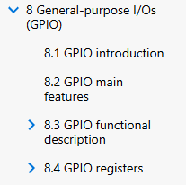

---

### Programming Manual

Programming Manual сфокусирован на ядре Cortex-M4: модель выполнения, система команд, исключения, системные регистры и базовые механизмы ядра.

Этот документ особенно полезен, когда нужно глубже понять поведение процессорного ядра, прерывания и низкоуровневые особенности исполнения кода.

---

### Errata Sheet

Errata Sheet — это список известных аппаратных ограничений и ошибок конкретного микроконтроллера, плюс обходные решения (workarounds), если они есть.

В отличие от Programming Manual, errata выпускается для конкретного устройства и его ревизий. Проверять errata перед запуском проекта — хорошая инженерная привычка.


---

## Архитектура микроконтроллера

Теперь плавно переходим к внутреннему устройству МК. Ядро — это только одна часть микроконтроллера. Помимо него есть память, шины и периферийные блоки.

Чтобы увидеть, как растёт сложность цифровых устройств, начнём с простого примера — микросхемы **74VHC00**, состоящей из 4 элементов И-НЕ (NAND):

|   |   |
|---|---|
|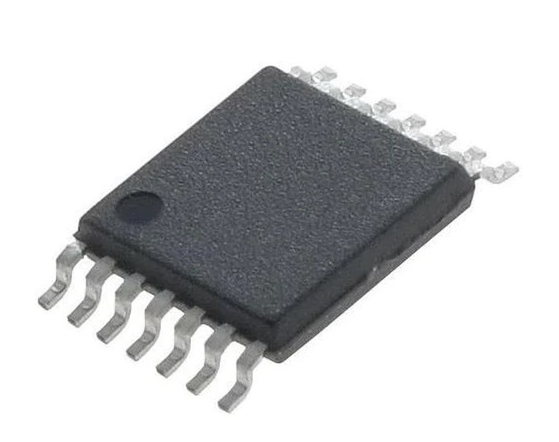 |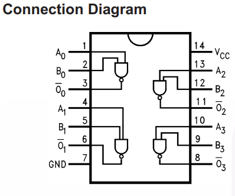 |
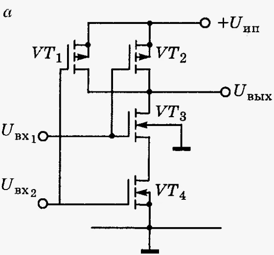

Эта микросхема выполняет логическую операцию И с последующей инверсией результата.

---

Следующий уровень — 4-битное АЛУ 74181 от TI. Оно выполняет набор базовых логических и арифметических операций над числами от 0 до 15:

|   |   |
|---|---|
|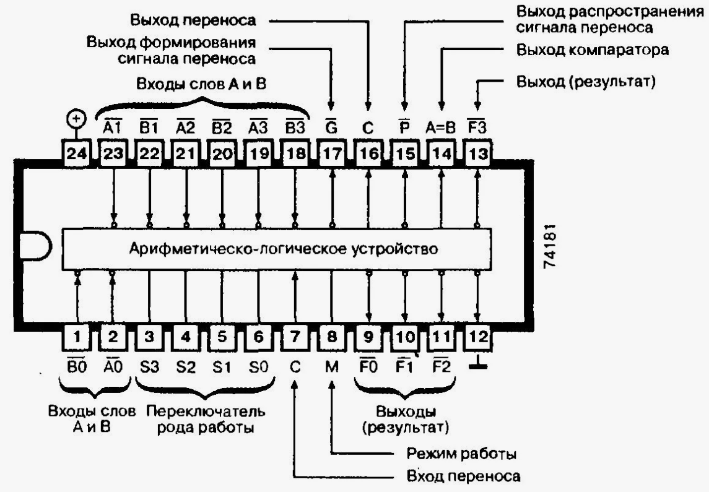 | 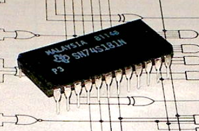 |
|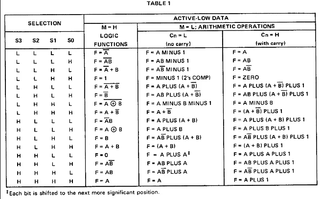 | |

Здесь уже удобно мыслить не отдельными транзисторами, а функциональными блоками.

---

Поднимемся ещё на уровень выше и посмотрим на микропроцессор ARM1 (1985 г.), который работает с 32-битными данными:

|   |   |
|---|---|
|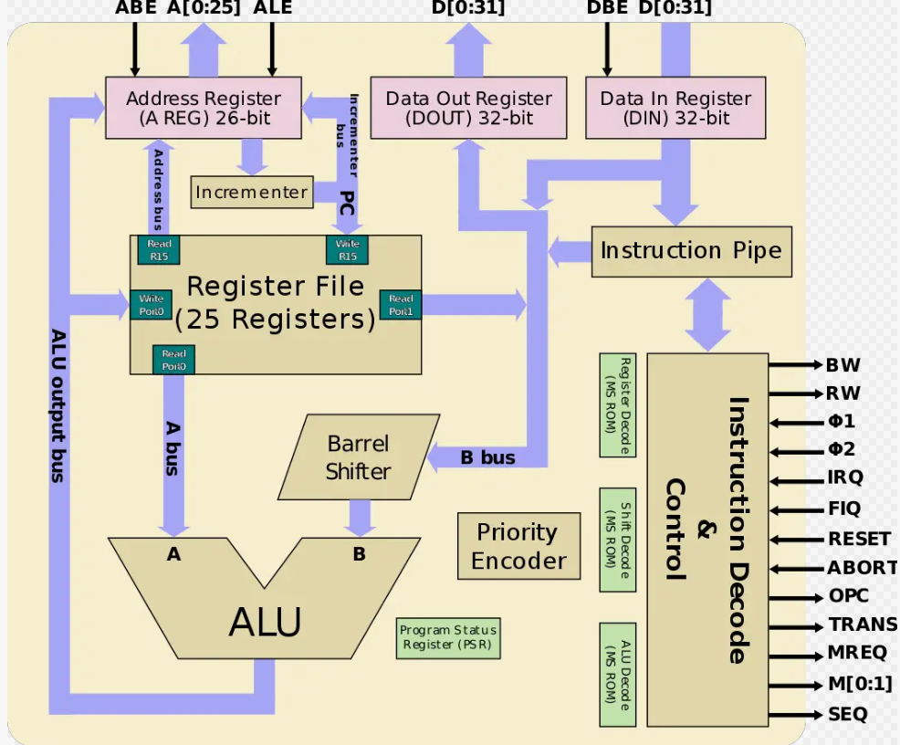|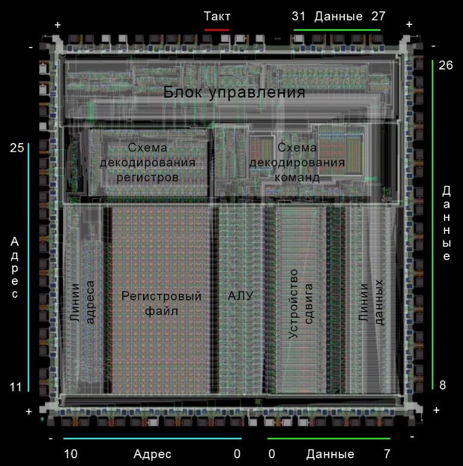|

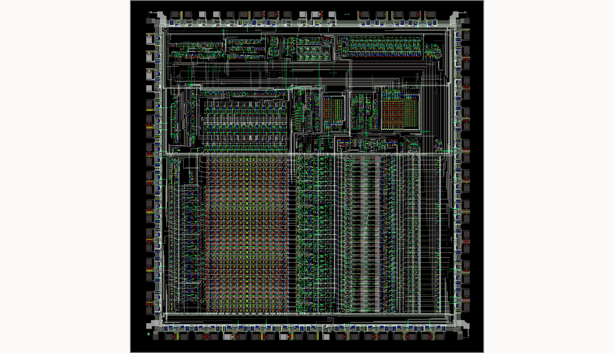

На этом уровне рисовать схему в виде отдельных логических элементов уже нецелесообразно: масштаб становится слишком большим.

---

И ещё шаг вверх: микроконтроллер — это уже сочетание процессорного ядра, памяти и периферии в одном кристалле.

|   |   |
|---|---|
|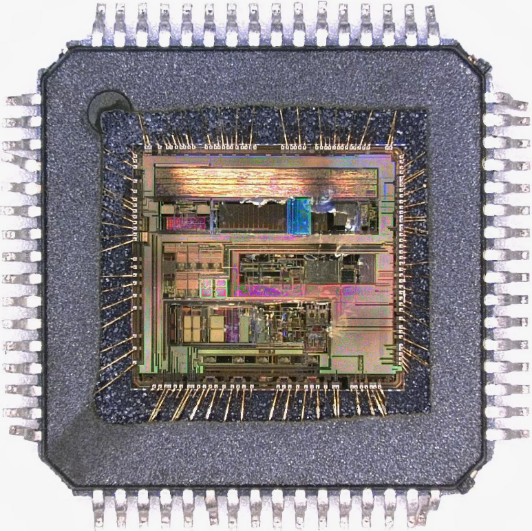|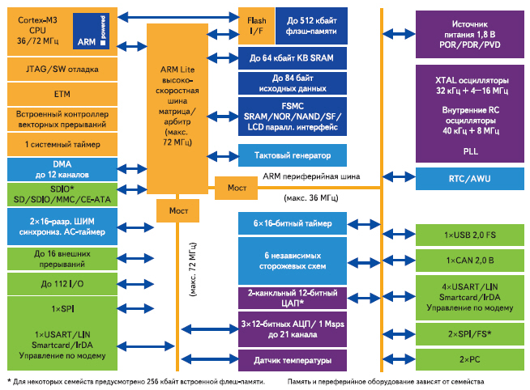|

Для понимания масштаба: ядро Cortex-M3 требует десятки тысяч транзисторов, а только Flash-память может требовать на порядок больше. Ядро исполняет команды программы, записанной во Flash, поэтому на практике нам важно понимать и устройство МК, и набор инструкций ядра.

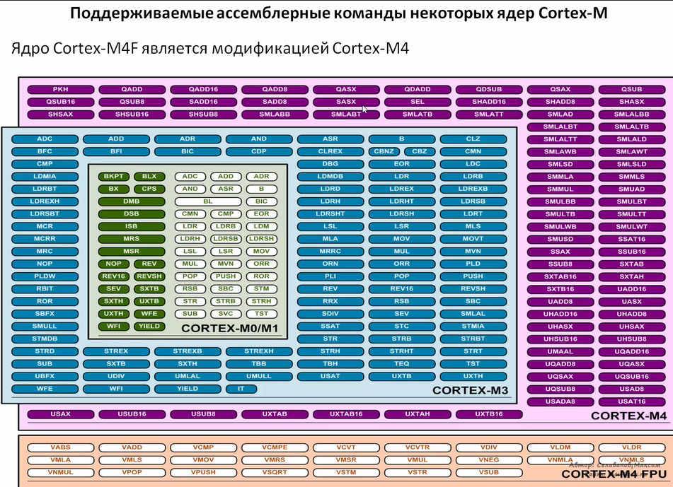

На изображении показаны ассемблерные команды, поддерживаемые разными ядрами Cortex-M.

---

## Регистры и операции над ними

В CMSIS работа с микроконтроллером строится вокруг регистров. Настройка периферии, управление GPIO, обмен данными по интерфейсам — всё это сводится к чтению и записи битов в регистры.

Перед практикой разберём базовые побитовые операции языка C.

### Операция "побитовое И" (`&`)

`&` выполняет сравнение двух битовых шаблонов: бит результата равен `1` только если в обоих операндах стоит `1`.

```c
0101  // A
0011  // B
====
0001  // A & B
```

Важно: `&` само по себе не "обнуляет бит регистра". Для сброса конкретного бита обычно используют маску с инверсией:

```c
REG &= ~(1 << n);  // сбросить бит n в 0
```

### Операция "побитовое ИЛИ" (`|`)

`|` устанавливает бит результата в `1`, если хотя бы в одном операнде стоит `1`.

```c
0001
1100
====
1101
```

### Операция "побитовое НЕ" (`~`)

`~` инвертирует все биты операнда. Результат зависит от разрядности типа (или от выбранной ширины в примере).

```c
// пример для 4-битной записи:
~0b0001 = 0b1110
```

### Операция "побитовый сдвиг влево" (`<<`)

Сдвиг влево на `n` позиций для беззнаковых чисел эквивалентен умножению на `2^n` (если нет переполнения).

```c
// 0b0001 = 1
// 0b0001 << 1 = 0b0010 = 2
// 0b0010 << 1 = 0b0100 = 4
// 0b0100 << 1 = 0b1000 = 8
```

Или сразу:

```c
// 0b0001 << 3 = 0b1000 = 8
```

Другой пример:

```c
0b00011010 << 1 = 0b00110100

// 0b00011010 = 26, а 0b00110100 = 52.
```

### Операция "побитовый сдвиг вправо" (`>>`)

Сдвиг вправо на `n` позиций для беззнаковых чисел эквивалентен целочисленному делению на `2^n`.

```c
// 0b1000 = 8
// 0b1000 >> 1 = 0b0100 = 4
// 0b0100 >> 1 = 0b0010 = 2
// 0b0010 >> 1 = 0b0001 = 1
```

Или сразу:

```c
// 0b1000 >> 3 = 0b0001 = 1
```

Другой пример:

```c
0b00110100 >> 1 = 0b00011010

// 0b00110100 = 52, а 0b00011010 = 26.
```

### Операция записи логической единицы в регистр

Чтобы установить конкретный бит в `1` и не затронуть остальные, используют побитовое ИЛИ с присваиванием:

```c
REGISTER |= (1 << n);
```

- `REGISTER` — имя регистра.
- `|=` — взять текущее значение, выполнить `|` с маской и записать результат обратно.
- `(1 << n)` — маска, где только бит `n` равен `1`.

#### Наглядный пример

Пусть есть 8-битный регистр:

```text
Начальное состояние: 0b00010011
```

Задача: установить в `1` бит с номером `5`.

1. Создаём маску: `(1 << 5)`.

```text
(1 << 5) = 0b00100000
```

2. Выполняем `OR` исходного значения с маской:

```text
   Исходный регистр:   0b00010011
               OR
          Маска:       0b00100000
               =
         Результат:    0b00110011
```

3. Визуально по битам:

| Биты (от старшего к младшему) | 7 | 6 | **5** | 4 | 3 | 2 | 1 | 0 |
| :--- | :---: | :---: | :---: | :---: | :---: | :---: | :---: | :---: |
| Исходное значение | 0 | 0 | **0** | 1 | 0 | 0 | 1 | 1 |
| Маска `(1<<5)` | 0 | 0 | **1** | 0 | 0 | 0 | 0 | 0 |
| Результат |0 | 0 | 0 | **1** | 1 | 0 | 1 | 1 |

Итог: бит `5` установлен, остальные биты не изменились.

```text
Результат: 0b00110011
```

---

В следующей части курса этот же подход применим уже к реальным регистрам STM32: от чтения таблицы в Reference Manual до точечной настройки конкретного бита в коде.

