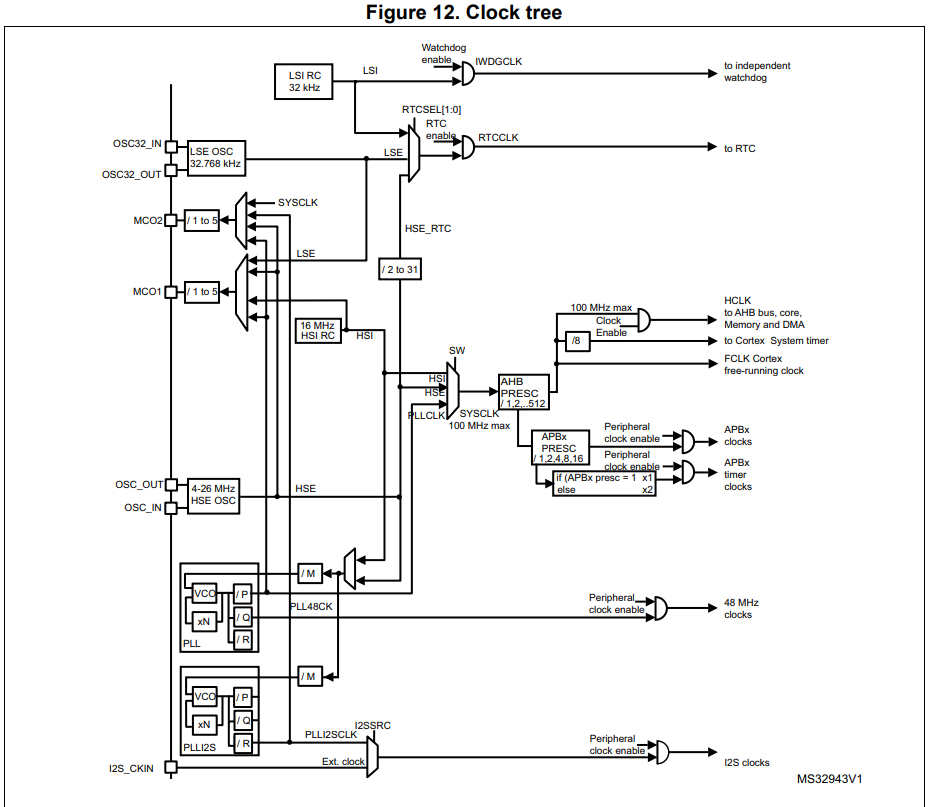

# Настройка тактирования системы на STM32F411 CMSIS

## Введение

Микроконтроллер STM32F411 имеет несколько источников тактирования и гибкую систему управления тактированием. Для того, чтобы эффективно настроить работу устройства, необходимо понимать основные принципы работы с тактовыми частотами, а также понимать, какие регистры и их поля отвечают за настройку тактирования системы. 

В этой части мы подробно рассмотрим: 
1. Система тактирования в STM32F411.
2. Описание основных регистров управления тактированием.
3. Как настроить тактирование с использованием внешнего генератора **HSE** и **PLL** (*Phase-Locked Loop*).
4. Пример кода настройки тактирования.

А это для тех, кто хочет перейти сразу к [примеру](https://github.com/DekartVan/stm32f4xx/tree/main/CMSIS/1.%20RCC#3-как-настроить-тактирование-с-использованием-внешнего-генератора-hse-и-pll-phase-locked-loop)

## 1. Система тактирования в STM32F411
Микроконтроллер (МК) STM32F411 имеет гибкую систему тактирования, которая позволяет адаптировать его работу под различные задачи, обеспечивая нужную производительность при оптимальном энергопотреблении. Основное, что нужно понимать — от частоты работы микроконтроллера зависит его производительность, а также скорость обработки данных. Чем выше частота тактирования, тем быстрее выполняются операции, но, с другой стороны, это также увеличивает энергопотребление устройства.

Для настройки тактирования важно учитывать несколько факторов: максимально допустимую частоту, особенности периферийных устройств и требования к энергопотреблению в разных режимах работы. Например, STM32F411 поддерживает максимальную частоту 100 МГц для системной тактовой частоты (*SYSCLK*). Однако, для некоторых периферийных шин, таких как APB1, поддерживается частота, значительно ниже — максимум 50 МГц.

STM32F411 использует две основные категории шин: AHB и APB. Каждая из этих шин имеет свой набор периферийных устройств, с которыми она взаимодействует, и определенные ограничения по максимальной частоте работы. Конкретно STM32F411 включает следующие шины:

* AHB1: Эта шина подключает такие периферийные устройства, как порты ввода-вывода GPIO, контроллеры DMA, а также USB.

* AHB2: Эта шина используется для подключения устройств, таких как USB OTG и SDIO.

* APB1: Включает устройства, такие как таймеры TIM2, TIM3, TIM4, TIM5, интерфейсы USART2, SPI2, I2C, I2S2 и другие. Частота этой шины ограничена 50 МГц.

* APB2: К этой шине подключены более высокоскоростные устройства, такие как TIM1, TIM9, TIM10, TIM11, а также USART1, USART6, SPI1 и другие. Частота для этой шины может достигать 100 МГц.

Более подробную информацию о составе шин и их взаимодействиях можно найти на 15-й странице даташита или на соответствующей диаграмме:  

Теперь давайте рассмотрим источники тактирования для микроконтроллера. В соответствии с даташитом (стр. 19), при сбросе настроек (в момент начальной инициалазиации) по умолчанию для тактирования процессора используется HSI (внутренний RC-генератор) с частотой 16 МГц. Однако, после внутренней инициализации с помощью программного кода можно выбрать другой источник тактовой частоты, такой как HSE (внешний генератор) или PLL (модуль фазовой автоподстройки частоты), позволяющий с помощью делителей обеспечить тактирование впоть до 100 МГц. То есть - система может такироваться от:

* HSI (High-Speed Internal) — внутренний RC-генератор, работающий на частоте 16 МГц.

* HSE (High-Speed External) — внешний генератор, который может работать в диапазоне частот от 4 до 26 МГц.

* Main PLL (Phase-Locked Loop) — фазовая автоподстройка частоты, которая использует один из предыдущих источников (HSI или HSE) и умножает его частоту до, максимум, 100 МГц.

Если система обнаруживает сбой в работе внешнего источника, она автоматически переключается на внутренний RC-генератор (HSI) и генерирует программное прерывание (если оно включено), уведомляя об ошибке.

Кроме того, микроконтроллер имеет два дополнительных источника тактирования, которые могут использоваться для периферийных устройств:
* LSI (Low-Speed Internal) — 32 кГц низкочастотный внутренний RC-генератор, который используется для работы независимого сторожевого таймера (IWDG) и, при необходимости, для тактирования RTC (реального времени), в том числе для функций автопробуждения в режиме Stop и Standby.

* LSE (Low-Speed External) — 32.768 кГц низкочастотный внешний кварцевый генератор, который может использоваться для тактирования RTC (реального времени), предоставляя точный источник времени для приложения.

На странице 93 Reference manual приведена страшная, на первый взгляд, схема тактирования: 

На схеме представлены основные компоненты системы тактирования STM32F411. Как вы уже заметили, схема на первый взгляд может показаться сложной, но если внимательно рассмотреть ее шаг за шагом, все элементы становятся более понятными. Важно понимать, как каждый из этих компонентов взаимодействует между собой для создания стабильной тактовой частоты для различных периферийных устройств.

* LSI RC 32 kHz — внутренний низкоскоростной генератор, работающий на частоте 32 кГц. Он используется для тактирования независимого сторожевого таймера (IWDG) и, при необходимости, для работы RTC (часов реального времени), когда устройство находится в низкоскоростных режимах.

* OSC32_IN и OSC32_OUT — это пины для подключения внешнего низкоскоростного генератора на частоте 32.768 кГц (обычно кристалл). Он подключается к модулю RTC для более точного отсчета времени по сравнению с внутренним генератором LSI.

* MCO2 и MCO1 — это выводы микроконтроллера (PC9 и PA8), через которые можно подать на внешние устройства сигнал тактовой частоты с различных источников (например, HSI, HSE, или PLL). Эти сигналы можно использовать для тактирования внешних компонентов.

* OSC_OUT и OSC_IN — это контакты для подключения внешнего высокоскоростного генератора (HSE). Этот генератор обычно работает в диапазоне от 4 до 26 МГц и используется для более стабильной и точной работы системы.

* PLL и PLLI2S — это фазовые автоподстройщики частоты. PLL используется для формирования системной частоты, которая может достигать 100 МГц, а PLLI2S используется для тактирования I2S интерфейса, поддерживая частоты от 8 кГц до 192 кГц.

* SW (Selection Switch) — это переключатель, который выбирает источник тактирования для SYSCLK (системных часов). Он может быть настроен для использования HSI, HSE или PLL.

* AHB PRESC — это делители для тактирования AHB шины (включает ядро, память, DMA и другие компоненты), которые могут быть настроены для уменьшения частоты в зависимости от требований к потребляемой мощности.

* APBx PRESC — делители для шин APB1 и APB2, которые управляют тактированием периферийных устройств. Это позволяет настроить оптимальную частоту для каждой периферии

* Peripheral Clock Enable — это блоки, которые включают тактирование различных периферийных устройств. Например, для работы с таймерами, интерфейсами связи и другими модулями.

## 2. Описание основных регистров управления тактированием.
Настройка тактирования микроконтроллера STM32F411 осуществляется с помощью регистров RCC (Reset and Clock Control). В микроконтроллере всего 21 регистр, но для базовой настройки тактирования достаточно использовать лишь 3 из них: RCC_CR, RCC_PLLCFGR и RCC_CFGR. 

### 2.1. RCC clock control register (RCC_CR):
Регистр RCC_CR используется для управления основными источниками тактирования (HSI, HSE, PLL), а также для настройки безопасности тактового сигнала (Clock Security System - CSS) и других функций, связанных с тактированием.
.png>)
Описание полей регистра RCC_CR:

* Bits 31:28 Reserved — зарезервированные биты, должны быть установлены в значение по умолчанию.
* Bit 27: PLLI2SRDY — флаг готовности PLLI2S. Устанавливается аппаратно, чтобы указать, что PLLI2S заблокирован и стабилен:
    * 0: PLLI2S не заблокирован.
    * 1: PLLI2S заблокирован.
* Bit 26: PLLI2SON — включение PLLI2S. Устанавливается или сбрасывается программно для включения PLLI2S:
    * 0: PLLI2S выключен.
    * 1: PLLI2S включен.
 
    При переходе в режим Stop или Standby этот бит сбрасывается аппаратно.
* Bit 25: PLLRDY — флаг готовности основного PLL (Main PLL). Устанавливается аппаратно, чтобы указать, что PLL стабилен и готов к работе:
    * 0: PLL не стабилен.
    * 1: PLL стабилен.
* Bit 24: PLLON — включение основного PLL. Устанавливается или сбрасывается программно:
    * 0: PLL выключен.
    * 1: PLL включен.
    
    При переходе в режим Stop или Standby этот бит сбрасывается аппаратно. Этот бит нельзя сбросить, если PLL используется как системный тактовый источник.
* Bit 19: CSSON — включение системы безопасности тактового сигнала (Clock Security System). Этот флаг включается программно для активации детектора неисправностей внешнего генератора HSE:
    * 0: Система безопасности тактового сигнала выключена.
    * 1: Система безопасности включена. Детектор работает при готовности HSE, а при сбое внешнего источника он отключается.
* Bit 18: HSEBYP — обход генератора HSE. Устанавливается программно для подключения внешнего тактового сигнала, минуя сам HSE-осциллятор:
    * 0: HSE работает как осциллятор.
    * 1: HSE обойдён внешним тактовым сигналом.

    Этот бит может быть установлен только если HSE выключен.
* Bit 17: HSERDY — флаг готовности HSE. Устанавливается аппаратно для индикатора готовности внешнего генератора HSE:
    * 0: HSE не готов.
    * 1: HSE готов.
* Bit 16: HSEON — включение генератора HSE. Устанавливается программно:
    * 0: HSE выключен.
    * 1: HSE включён.

    При переходе в режим Stop или Standby этот бит сбрасывается аппаратно.     Этот бит нельзя сбросить, если HSE используется как тактовый источник для системы.
* Bits 15:8 HSICAL[7:0] — калибровка внутреннего высокоскоростного генератора HSI. Эти биты автоматически инициализируются при старте устройства.
* Bits 7:3 HSITRIM[4:0] — настройка дополнительного значения для регулировки частоты HSI в зависимости от изменений напряжения и температуры.
* Bit 1: HSIRDY — флаг готовности HSI. Устанавливается аппаратно для индикации готовности внутреннего генератора HSI:
    * 0: HSI не готов.
    * 1: HSI готов.
* Bit 0: HSION — включение внутреннего генератора HSI. Устанавливается программно:
    * 0: HSI выключен.
    * 1: HSI включён.

    Этот бит не может быть сброшен, если HSI используется как системный тактовый источник, и он устанавливается аппаратно при выходе из режима Stop или Standby, а также при сбое внешнего генератора HSE.

### 2.2. RCC PLL configuration register (RCC_PLLCFGR):
Регистр **RCC_PLLCFGR** используется для настройки параметров фазовой автоподстройки частоты (**PLL**) и управления входными и выходными частотами. Этот регистр позволяет выбирать источники тактирования для PLL, устанавливать множители и делители для получения нужной частоты.

#### Описание полей регистра RCC_PLLCFGR:

- **Bits 31:28 Reserved** — зарезервированные биты, должны быть установлены в значение по умолчанию.
    
- **Bits 27:24 PLLQ** — делитель для основной PLL (Main PLL) для тактирования **USB OTG FS** и **SDIO**. Устанавливается программно для управления частотой USB OTG FS и SDIO:
    - Эти биты можно записывать только если PLL выключен.
    - USB OTG FS требует частоту 48 МГц для правильной работы, а SDIO требует частоту, не превышающую 48 МГц.
    - Частота **USB OTG FS** = частота **VCO** / **PLLQ**, где **2 ≤ PLLQ ≤ 15**.
    - Допустимые значения:
        - **0000**: PLLQ = 0 (неправильная конфигурация)
        - **0001**: PLLQ = 1 (неправильная конфигурация)
            
        - **0010**: PLLQ = 2
            
        - **0011**: PLLQ = 3
            
        - **0100**: PLLQ = 4
            
        - ...
            
        - **1111**: PLLQ = 15
            
- **Bit 23 Reserved** — зарезервированный бит, должен быть установлен в значение по умолчанию.
    
- **Bit 22 PLLSRC** — источник тактового сигнала для основной PLL и аудио PLL (PLLI2S). Устанавливается программно для выбора источника тактирования:
    
    - **0**: выбран HSI (внутренний RC-генератор) как источник PLL и PLLI2S.
        
    - **1**: выбран HSE (внешний генератор) как источник PLL и PLLI2S.
        
    
    Эти биты можно записывать только при выключенной PLL и PLLI2S.
    
- **Bits 21:18 Reserved** — зарезервированные биты, должны быть установлены в значение по умолчанию.
    
- **Bits 17:16 PLLP** — делитель для основной PLL, регулирующий частоту основного системного тактового сигнала (SYSCLK):
    
    - Эти биты можно записывать только если PLL выключен.
        
    - Внимание: необходимо правильно настроить эти биты, чтобы частота не превышала 100 МГц на этом домене.
        
    - Частота выходного сигнала PLL = частота VCO / **PLLP**, где возможные значения для **PLLP**: 2, 4, 6, 8.
        
    - Допустимые значения:
        
        - **00**: PLLP = 2
            
        - **01**: PLLP = 4
            
        - **10**: PLLP = 6
            
        - **11**: PLLP = 8
            
- **Bits 14:6 PLLN** — множитель основной PLL для **VCO**. Устанавливается программно для управления множителем для генерации нужной выходной частоты VCO:
    
    - Эти биты можно записывать только при выключенной PLL.
        
    - Внимание: необходимо правильно настроить эти биты, чтобы частота выходного сигнала VCO находилась в пределах от 100 МГц до 432 МГц.
        
    - Частота VCO = частота входа PLL × **PLLN**, где **50 ≤ PLLN ≤ 432**.
        
    - Допустимые значения:
        
        - **000000000**: PLLN = 0 (неправильная конфигурация)
            
        - **000000001**: PLLN = 1 (неправильная конфигурация)
            
        - ...
            
        - **001100100**: PLLN = 100
            
        - ...
            
        - **110110000**: PLLN = 432
            
        - **110110001**: PLLN = 433 (неправильная конфигурация)
            
- **Bits 5:0 PLLM** — делитель для входной частоты PLL. Устанавливается программно для деления частоты перед подачей на VCO:
    
    - Эти биты можно записывать только при выключенной PLL.
        
    - Внимание: необходимо правильно настроить эти биты, чтобы частота входного сигнала VCO была в диапазоне от 1 до 2 МГц. Рекомендуется выбирать частоту 2 МГц для минимизации джиттера PLL.
        
    - Частота входа VCO = частота входа PLL / **PLLM**, где **2 ≤ PLLM ≤ 63**.
        
    - Допустимые значения:
        
        - **000000**: PLLM = 0 (неправильная конфигурация)
            
        - **000001**: PLLM = 1 (неправильная конфигурация)
            
        - **000010**: PLLM = 2
            
        - **000011**: PLLM = 3
            
        - ...
            
        - **111110**: PLLM = 62
            
        - **111111**: PLLM = 63

### 2.3. RCC clock configuration register (RCC_CFGR)
Регистр **RCC_CFGR** используется для конфигурации различных тактовых выходов и предделителей, а также для выбора источника системных часов.

![!\[\[Pasted image 20260226151154.png\]\]](<../../Images/Pasted image 20260226151154.png>)
#### Описание полей регистра RCC_CFGR:

- **Bits 31:30 MCO2[1:0]** — выбор источника тактового сигнала для **MCO2** (выход тактового сигнала микроконтроллера 2):
    
    - **00**: Выбрана системная частота (**SYSCLK**).
        
    - **01**: Выбрана частота от PLLI2S.
        
    - **10**: Выбрана частота от внешнего генератора HSE.
        
    - **11**: Выбрана частота от основного PLL.
        
    
    Важно: Изменение этих битов может вызвать скачки на выходе **MCO2**, поэтому рекомендуется настраивать их только после сброса, до включения внешних осцилляторов и PLL.
    
- **Bits 29:27 MCO2PRE** — предделитель для **MCO2**:
    
    - **0xx**: Без деления.
        
    - **100**: Деление на 2.
        
    - **101**: Деление на 3.
        
    - **110**: Деление на 4.
        
    - **111**: Деление на 5.
        
    
    Важно: Изменение этого предделителя может вызвать скачки на выходе **MCO2**, поэтому рекомендуется настраивать его только после сброса, до включения внешних осцилляторов и PLL.
    
- **Bits 26:24 MCO1PRE** — предделитель для **MCO1**:
    
    - **0xx**: Без деления.
        
    - **100**: Деление на 2.
        
    - **101**: Деление на 3.
        
    - **110**: Деление на 4.
        
    - **111**: Деление на 5.
        
    
    Важно: Изменение этого предделителя может вызвать скачки на выходе **MCO1**, поэтому рекомендуется настраивать его только после сброса, до включения внешних осцилляторов и PLL.
    
- **Bit 23 I2SSRC** — выбор источника тактового сигнала для **I2S**:
    
    - **0**: Используется тактовый сигнал от PLLI2S.
        
    - **1**: Используется внешний тактовый сигнал, подаваемый на пин **I2S_CKIN**.
        
    
    Рекомендуется настраивать этот бит только после сброса, до включения модуля I2S.
    
- **Bits 22:21 MCO1** — выбор источника тактового сигнала для **MCO1** (выход тактового сигнала микроконтроллера 1):
    
    - **00**: Выбрана частота от HSI.
        
    - **01**: Выбрана частота от LSE (внешний низкочастотный осциллятор).
        
    - **10**: Выбрана частота от HSE.
        
    - **11**: Выбрана частота от основного PLL.
        
    
    Важно: Изменение этих битов может вызвать скачки на выходе **MCO1**, поэтому рекомендуется настраивать их только после сброса, до включения внешних осцилляторов и PLL.
    
- **Bits 20:16 RTCPRE** — делитель для частоты HSE, используемой для тактового сигнала **RTC** (часов реального времени):
    
    - Эти биты программно делят входной сигнал HSE для получения тактовой частоты для RTC, что важно для корректной работы часов реального времени.
        
    - Допустимые значения:
        
        - **00000**: Без тактового сигнала.
            
        - **00001**: Без тактового сигнала.
            
        - **00010**: Деление на 2.
            
        - **00011**: Деление на 3.
            
        - **00100**: Деление на 4.
            
        - ...
            
        - **11110**: Деление на 30.
            
        - **11111**: Деление на 31.
            
    
    Важно: Эти биты необходимо настроить до выбора источника тактирования для RTC.
    
- **Bits 15:13 PPRE2** — предделитель для высокоскоростной шины **APB2**:
    
    - Эти биты программно управляют делением тактовой частоты **AHB** для шины **APB2**, которая подключает высокоскоростные периферийные устройства.
        
    - Внимание: необходимо правильно настроить эти биты, чтобы не превысить 100 МГц на этом домене.
        
    - Допустимые значения:
        
        - **0xx**: Тактовая частота AHB не делится.
            
        - **100**: Деление на 2.
            
        - **101**: Деление на 4.
            
        - **110**: Деление на 8.
            
        - **111**: Деление на 16.
            
- **Bits 12:10 PPRE1** — предделитель для низкоскоростной шины **APB1**:
    
    - Эти биты программно управляют делением тактовой частоты **AHB** для шины **APB1**, которая подключает низкоскоростные периферийные устройства.
        
    - Внимание: необходимо правильно настроить эти биты, чтобы не превысить 50 МГц на этом домене.
        
    - Допустимые значения:
        
        - **0xx**: Тактовая частота AHB не делится.
            
        - **100**: Деление на 2.
            
        - **101**: Деление на 4.
            
        - **110**: Деление на 8.
            
        - **111**: Деление на 16.
            
- **Bits 9:8 Reserved** — зарезервированные биты, должны быть установлены в значение по умолчанию.
    
- **Bits 7:4 HPRE** — предделитель для шины **AHB**:
    
    - Эти биты программно управляют делением системной частоты **SYSCLK** для шины **AHB**.
        
    - Внимание: необходимо правильно настроить эти биты, чтобы не превысить максимально допустимую частоту.
        
    - Допустимые значения:
        
        - **0xxx**: Системная частота не делится.
            
        - **1000**: Деление на 2.
            
        - **1001**: Деление на 4.
            
        - **1010**: Деление на 8.
            
        - **1011**: Деление на 16.
            
        - **1100**: Деление на 64.
            
        - **1101**: Деление на 128.
            
        - **1110**: Деление на 256.
            
        - **1111**: Деление на 512.
            
- **Bits 3:2 SWS** — состояние переключения системного тактового сигнала:
    
    - Эти биты аппаратно устанавливаются для указания источника, который используется для системных часов.
        
    - Допустимые значения:
        
        - **00**: Используется **HSI** (внутренний генератор).
            
        - **01**: Используется **HSE** (внешний генератор).
            
        - **10**: Используется **PLL**.
            
        - **11**: Запрещено.
            
- **Bits 1:0 SW** — выбор источника системных часов:
    
    - Эти биты программно устанавливаются для выбора источника тактового сигнала для системных часов.
        
    - Допустимые значения:
        
        - **00**: Выбран **HSI** (внутренний генератор).
            
        - **01**: Выбран **HSE** (внешний генератор).
            
        - **10**: Выбран **PLL**.
            
        - **11**: Запрещено.

## 3. Как настроить тактирование с использованием внешнего генератора **HSE** и **PLL** (*Phase-Locked Loop*).

Для настройки тактирования системы с использованием внешнего генератора HSE и PLL (Phase-Locked Loop) необходимо выполнить несколько шагов. Эти шаги включают запуск внешнего генератора, настройку PLL, запуск PLL и переключение на работу от PLL. Рассмотрим каждый из шагов подробно с пояснениями к коду.

Настройка тактирования с использованием HSE и PLL позволяет получить более высокую стабильность и точность частоты, чем при использовании только HSI. Этот процесс состоит из нескольких этапов:

1. Запуск генератора HSE
2. Настройка PLL
3. Запуск PLL
4. Настройка циклов ожидания для Flash-памяти
5. Настройка делителей шин
6. Переключение на работу от PLL
7. Отключение HSI

### 3.1. Запуск генератора HSE

Для начала необходимо включить внешний генератор HSE, частота которого в моём случае 25 МГц. Включение выполняется с помощью бита HSEON в регистре RCC_CR.

```C
RCC->CR |= RCC_CR_HSEON;  // Включаем внешний генератор HSE
for (int StartUpCounetr = 0; StartUpCounetr < HSE_TIMEOUT; StartUpCounetr++)
{
    if (RCC->CR & RCC_CR_HSERDY)  // Проверка готовности HSE
        break;
}
```
* RCC_CR_HSEON — бит для включения HSE.
* RCC_CR_HSERDY — флаг готовности HSE. Он будет установлен, когда внешний генератор стабилизируется.

Если генератор не готов в течение определенного времени, мы останавливаем HSE и возвращаем ошибку:
```C
if (!(RCC->CR & RCC_CR_HSERDY))
{
    RCC->CR &= ~RCC_CR_HSEON;  // Отключаем HSE в случае ошибки
    return RCC_ERROR;
}
```
### 3.2. Настройка PLL

После того как HSE готов, мы настраиваем PLL, который будет использовать HSE как источник тактирования. Для этого необходимо правильно настроить биты регистра RCC_PLLCFGR.
```C
RCC->PLLCFGR &= ~(RCC_PLLCFGR_PLLM | RCC_PLLCFGR_PLLN | RCC_PLLCFGR_PLLP);  // Сбрасываем значения
RCC->PLLCFGR |= (12 << RCC_PLLCFGR_PLLM_Pos | 96 << RCC_PLLCFGR_PLLN_Pos | 0x02 << RCC_PLLCFGR_PLLP_Pos);  // Устанавливаем M=12, N=96, P=2
```
* PLLM — делитель для входа PLL. В данном примере мы устанавливаем значение 12: 25 МГц / 12 = 2,083 МГц.
* PLLN — множитель для PLL. Мы устанавливаем значение 96, чтобы увеличить частоту: 2,083 МГц * 96 = 200 МГц.
* PLLP — делитель для выходной частоты PLL. Мы устанавливаем значение 2 для получения частоты 100 МГц: 200 МГц / 2 = 100 МГц.

### 3.3. Запуск PLL
После настройки PLL необходимо включить его с помощью бита PLLON в регистре RCC_CR. После этого мы ждем, пока PLL стабилизируется.
```C
RCC->CR |= RCC_CR_PLLON;  // Включаем PLL
for (int StartUpCounetr = 0; StartUpCounetr < PLL_TIMEOUT; StartUpCounetr++)
{
    if (RCC->CR & RCC_CR_PLLRDY)  // Проверка готовности PLL
        break;
}
```
* RCC_CR_PLLON — бит для включения PLL.
* RCC_CR_PLLRDY — флаг готовности PLL.

Если PLL не готов, мы останавливаем PLL и HSE, и возвращаем ошибку.
```C
if (!(RCC->CR & RCC_CR_PLLRDY))
{
    RCC->CR &= ~RCC_CR_HSEON;  // Отключаем HSE
    RCC->CR &= ~RCC_CR_PLLON;  // Отключаем PLL
    return RCC_ERROR;
}
```

### 3.4. Настройка циклов ожидания для Flash-памяти

После того как PLL стабилизировался, необходимо настроить задержки для Flash-памяти с помощью регистра FLASH_ACR. Это важно, чтобы система работала с максимальной частотой без ошибок при доступе к памяти. Более подробно на стр. 45 Reference Manual

```C
FLASH->ACR |= FLASH_ACR_LATENCY_3WS;  // Устанавливаем 3 такта ожидания для Flash
```
### 3.5. Настройка делителей шин

Затем мы настраиваем делители для различных шин AHB и APB. В этом примере делитель для APB1 установлен в значение 4.

```C
RCC->CFGR &= ~(RCC_CFGR_HPRE | RCC_CFGR_PPRE1 | RCC_CFGR_PPRE2);  // Сбрасываем все делители
RCC->CFGR |= (0x4 << RCC_CFGR_PPRE1_Pos);  // Настройка делителя для APB1
```

### 3.6. Переключение на работу от PLL

Теперь мы переключаем систему на использование PLL как источника системных часов (SYSCLK). Для этого устанавливаем соответствующий бит в регистре RCC_CFGR.

```C
RCC->CFGR |= RCC_CFGR_SW_PLL;  // Переключаемся на PLL
while ((RCC->CFGR & RCC_CFGR_SWS) != RCC_CFGR_SWS_PLL) {}  // Ожидаем переключение на PLL
```
* RCC_CFGR_SW_PLL — бит для выбора PLL как системного источника.
* RCC_CFGR_SWS — флаг, который показывает текущий источник тактирования. Мы ждем, пока он не установится на PLL.

### 3.7. Отключение HSI

После переключения на PLL можно безопасно отключить внутренний генератор HSI, если он больше не используется.

```C
RCC->CR &= ~RCC_CR_HSION;  // Отключаем HSI
```

## 4. Пример кода настройки тактирования

RCC.h
```C
#ifndef RCC_H
#define RCC_H
#include "stm32f411xe.h"

#define HSE_TIMEOUT 0x1000
#define PLL_TIMEOUT 0x1000

typedef enum {
    RCC_OK = 0,
    RCC_ERROR = 1
} RCC_ErrorStatus;

RCC_ErrorStatus ClockInit(void);


#endif
```

RCC.c
```C
#include "RCC.h"

/*
Последовательность настройки тактирования системы:
1. Запск генератора HSE
2. Настройка PLL
3. Запуск PLL
4. Настройка циклов ожидания FLASH
5. Настройка делителя шин
6. Переключение на работу от PLL
*/

RCC_ErrorStatus ClockInit(void)
{	
	// 1. Запуск генератора HSE:
	RCC->CR |= RCC_CR_HSEON;
	for (int StartUpCounetr = 0; StartUpCounetr < HSE_TIMEOUT; StartUpCounetr++)
	{
		if (RCC->CR & RCC_CR_HSERDY)
			break;
	}
		
	if (!(RCC->CR & RCC_CR_HSERDY))
	{
		RCC->CR &= ~RCC_CR_HSEON;
		return RCC_ERROR;
	}
	
	// 2. Настройка PLL
	RCC->PLLCFGR &= ~(RCC_PLLCFGR_PLLM | RCC_PLLCFGR_PLLN | RCC_PLLCFGR_PLLP);
	RCC->PLLCFGR |= (12 << RCC_PLLCFGR_PLLM_Pos | 96  << RCC_PLLCFGR_PLLN_Pos | 0x02 << RCC_PLLCFGR_PLLP_Pos);
	
	
	// 3. Запуск PLL
	RCC->CR |= RCC_CR_PLLON;
	for(int StartUpCounetr=0; StartUpCounetr < PLL_TIMEOUT; StartUpCounetr++)
	{
		if(RCC->CR & RCC_CR_PLLRDY)
			break;
	}
	
	if(!(RCC->CR & RCC_CR_PLLRDY))
	{
			RCC->CR &= ~RCC_CR_HSEON;
			RCC->CR &= ~RCC_CR_PLLON;
			return RCC_ERROR;
	}
	
	// 4. Настройка циклов ожидания FLASH
	FLASH->ACR |= FLASH_ACR_LATENCY_3WS;
	
  // 5. Настройка делителей
	RCC->CFGR &= ~(RCC_CFGR_HPRE | RCC_CFGR_PPRE1 | RCC_CFGR_PPRE2);
	RCC->CFGR |= (0x4 << RCC_CFGR_PPRE1_Pos); 
	
	// 6. Переключение на PLL
	RCC->CFGR |= RCC_CFGR_SW_PLL;
	while ((RCC->CFGR & RCC_CFGR_SWS) != RCC_CFGR_SWS_PLL) {}
		
	// 7. Отключение HSI
	RCC->CR &= ~RCC_CR_HSION;

	return RCC_OK;
}


```


