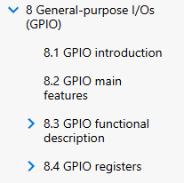
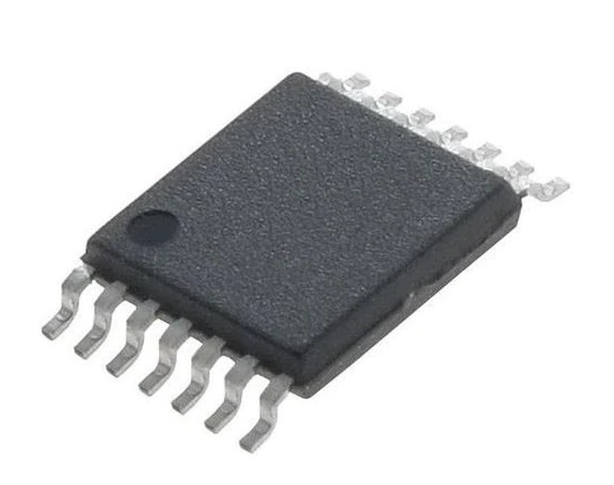
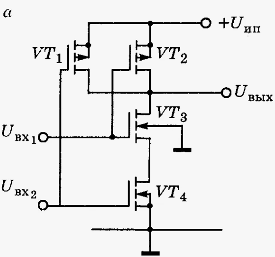
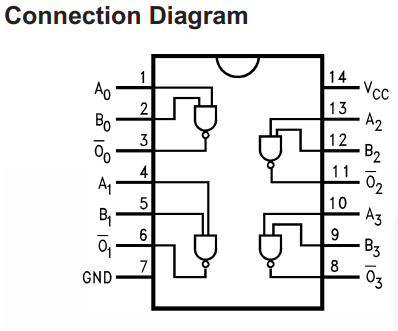
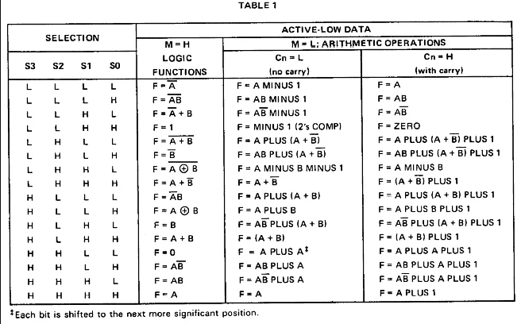
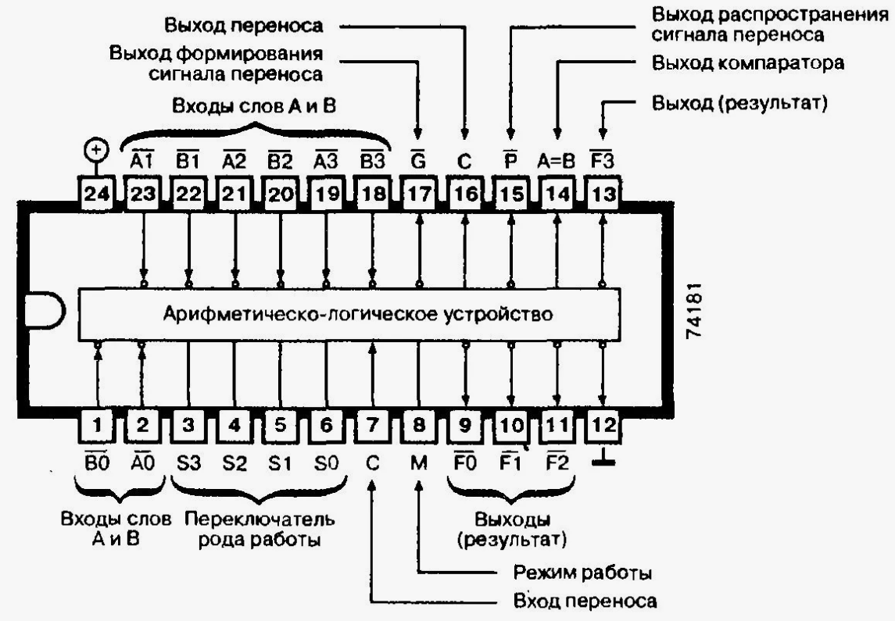
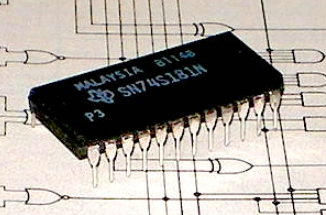

# Введение

Микроконтроллеры серии STM32 позволяют решать широкий спектр технических задач. В линейке STM представлены различные модели: от экономичных и компактных STM32L до мощных STM32H7, которые работают на частотах до 550 МГц.

Однако для эффективного использования этих устройств требуются определенные знания и навыки.

Существует несколько популярных библиотек для работы с микроконтроллерами серии STM: HAL (Hardware Access Level), LL (Low-Layer) и CMSIS (Cortex Microcontroller Software Interface Standard). У каждой из них свои преимущества и недостатки. HAL ускоряет разработку, но снижает производительность и увеличивает объём кода. LL занимает промежуточное положение между HAL и CMSIS, предлагая более низкий уровень абстракции. CMSIS даёт разработчику возможность напрямую работать с регистрами, создавая программу с нуля. Выбор библиотеки зависит от предпочтений программиста или команды. В этих лекциях мы сосредоточимся на CMSIS, так как она помогает глубже понять устройство и принципы работы микроконтроллера.

---

## Выбор микроконтроллера

Микроконтроллеры разных типов отличаются внутренним устройством, набором периферийных функций и названиями регистров. Однако эти различия не всегда существенны, особенно в рамках одной линейки. Например, переход между stm32f405, 407 и 411 не вызывает сложностей. При внимательном подходе программа легко переносится и между различными линейками.

В данном курсе я буду работать с платой black pill, на которой установлен микроконтроллер STM32F411CEU6.

---

## Документация

Первое, с чем нам придётся познакомиться - документация. Она как свод заповедей или уголовный кодекс - позволяет понять границы дозволенного и не наделать ошибок. Основными документами для работы с STM являются:

* [Datasheet](Ссылка)
* [Reference manual](Ссылка)
* [Programming Manual](Ссылка)
* [Errata Sheet](Ссылка)

### Datasheet

Datasheet содержит данные о периферийных устройствах микроконтроллера, его распиновке, электрических параметрах и маркировке.

Во-первых, обратим внимание на раздел _8. Ordering information_. Здесь объяснено значение каждого символа в маркировке. Например, для модели STM32F411CEU6 указаны 48/49 контактов, 512 килобайт Flash-памяти, корпус UFQFPN и рабочий температурный диапазон от -40 до +125 градусов Цельсия.
![!\[\[Pasted image 20260226223413.png\]\]](<../../Images/Ordering information.png>)

Далее рассмотрим раздел _2.1 Device overview_. В нем представлена таблица, показывающая, какая периферия имеется в микроконтроллере и в каком количестве.
![!\[\[Pasted image 20260226223637.png\]\]](<../../Images/features and peripheral counts.png>)

Эта информация важна для понимания возможностей камня. В даташите кратко описаны каждый блок периферии, его базовые функции и ограничения. На странице 38 в таблице «Table 8. STM32F411xC/xE pin definitions» указаны назначения каждого вывода и их функции. Мы вернемся к этой таблице позже.

Раздел «Electrical characteristics» описывает электрические параметры микроконтроллера: напряжения питания, токи потребления, условия и методы эксплуатации. Этот раздел особенно полезен при разработке электрических схем с использованием микроконтроллеров STM.

---

### Reference manual

Основной документ, необходимый нам для работы, — это Reference Manual. В нём детально описана архитектура микроконтроллера, вся периферия, регистры и их содержимое, а также советы и рекомендации для разработчиков. К этому документу мы будем обращаться чаще всего. Структура документа такова: сначала описывается определённая часть микроконтроллера (RCC, FLASH, GPIO, ADC и другие), а затем — регистры, относящиеся к этому блоку.

---

### Programming Manual

Этот документ пригодится нам не сразу, но в нём есть много полезной информации для разработчика: о ядре процессора, системе команд и периферийных устройствах. Он особенно полезен при детальном изучении микроконтроллера. Заметим, что в руководстве по программированию содержатся сведения обо всех микроконтроллерах на базе ядра Arm Cortex-M4, включая линейки STM32F3, F4, STM32G4, L4 и другие.

---

### Errata Sheet

Errata Sheet — это список всех известных багов и косяков в микроконтроллерах, а также советы, как о них не споткнуться. В отличии от Programming manual - errata sheet пишется для каждой версии контроллера отдельно. Есть баги, у которых нет решения :).

## Архитектура микроконтроллера

Ядро микроконтроллера - это лишь одна его состовная часть, помимо него имеется множество различной переферии. От памяти до интерфейсов. 

Чтобы разрбраться в устройстве МК - посмотрим на микросхему **74VHC00**, состаящую из 4 элементов И-НЕ:

|   |   |
|---|---|
||  |
|  |   |

Данная микросхема выполняет операцию умножения с последующей инверсией. Теперь взглянем на более сложное устройство - АЛУ (арифметическо-логическое устрйоство) 74181 от TI, которое может выполнять примитивные опреации с числами от 0 до 15. Доступный перечень операций приведёт в таблице. Схема данного устройства изображается уже не отдельными компонентами, а целыми логическими элементами.

|   |   |
|---|---|
|  |  |
|  |  |

